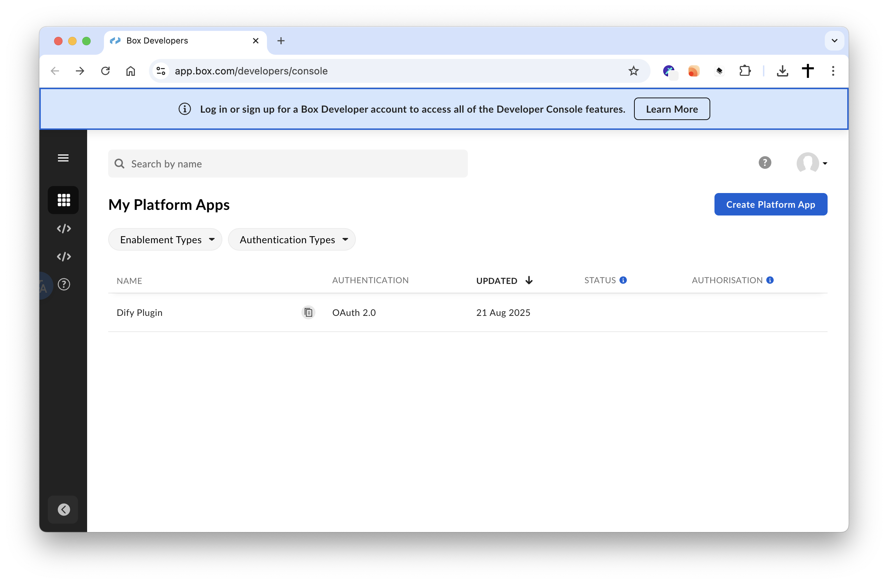

# Box Datasource Plugin

**Author:** langgenius  
**Version:** 0.1.0  
**Type:** datasource

## Description

The Box Datasource Plugin is a Dify plugin that enables seamless integration with Box cloud storage. This plugin allows you to browse, search, and download files from your Box account, making it easy to access and process your cloud-stored documents within Dify applications.

## Setup

## OAuth Configuration in Box

To use this plugin, you need to configure OAuth 2.0 in your Box developer account:

### Step 1: Create a Box App

1. Go to the [Box Developer Console](https://app.box.com/developers)
2. Click **"Create New App"** at https://app.box.com/developers/console/newapp
3. Select **"Custom App"** and click **"Next"**
4. Choose **"Standard OAuth 2.0"** authentication method
5. Give your app a name (e.g., "Dify Box Integration")
6. Click **"Create App"**



### Step 2: Configure OAuth Settings

1. In your app dashboard, go to the **"Configuration"** tab
2. Under **"OAuth 2.0 Redirect URIs"**, add your Dify callback URL:
   ```
   https://your-dify-instance.com/console/api/oauth/plugin/langgenius/box_datasource/box/datasource/callback
   ```
3. Under **"Application Scopes"**, ensure the following scopes are enabled:
   - `root_readwrite` (required for file operations)
4. Click **"Save Changes"**

### Step 3: Get Your Credentials

1. In the **"Configuration"** tab, find the **"OAuth 2.0 Credentials"** section
2. Copy your **Client ID** and **Client Secret**
3. These will be used in the plugin configuration

### Step 4: Authorize Your App

1. Go to the **"Authorization"** tab
2. Click **"Review and Submit"** if this is a production app
3. For development/testing, you can use the app immediately

## Usage

### Plugin Configuration

1. **Add the plugin** to your Dify workspace
2. **Configure OAuth credentials**:
   - Enter your Box **Client ID**
   - Enter your Box **Client Secret**
3. **Authorize the connection**:
   - Click the authorization button
   - You'll be redirected to Box to grant permissions
   - After authorization, you'll receive access and refresh tokens

## Troubleshooting

### Common Issues

1. **Authentication Errors (401)**
   - Verify your Client ID and Client Secret are correct
   - Ensure your app has the required scopes
   - Check if your access token has expired

2. **File Not Found Errors**
   - Verify the folder path exists in your Box account
   - Check file permissions in Box
   - Ensure the file ID is valid

3. **Network Errors**
   - Check your internet connection
   - Verify Box API is accessible from your network
   - Check for firewall restrictions

### Getting Help

- Check the [Box API Documentation](https://developer.box.com/)
- Review the plugin logs for detailed error information
- Ensure your Box app is properly configured with the correct redirect URIs

## License

This plugin is part of the Dify ecosystem and follows the same licensing terms as the Dify platform.

