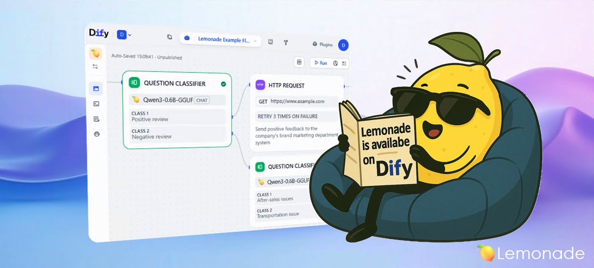
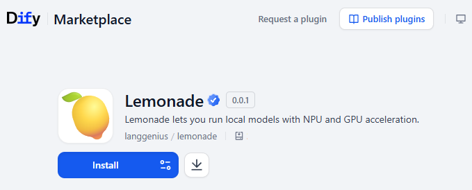
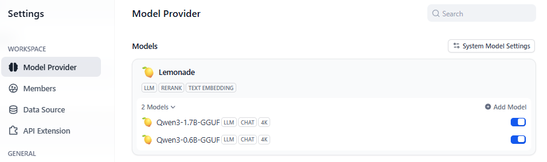
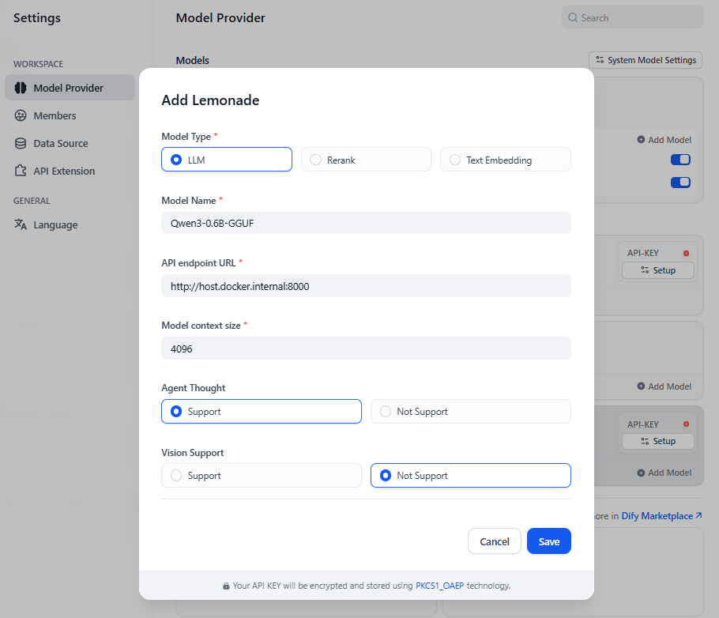
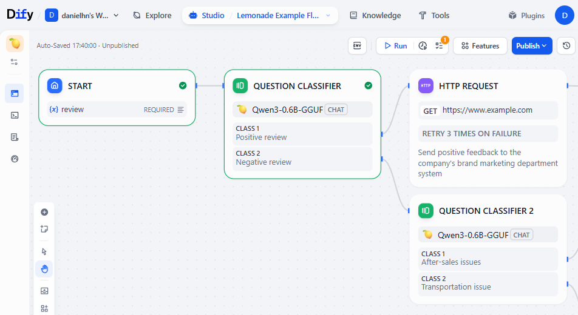

## Overview



[Lemonade](https://github.com/lemonade-sdk/lemonade) is a client inference framework (Windows, Linux) designed for seamless deployment of large language models (LLMs) with NPU and GPU acceleration. It supports models like Qwen, Llama, DeepSeek, and more, optimized for different hardware configurations.

Lemonade enables local execution of LLMs, providing enhanced data privacy and security by keeping your data on your own machine while leveraging hardware acceleration for improved performance.

Dify integrates with Lemonade Server to provide LLM, text embedding, and reranking capabilities for models deployed locally.

## Configure

### 1. Install and Run Lemonade Server

Visit the [Lemonade's Website](https://lemonade-server.ai/) to download the Lemonade Server client for your system.

To start Lemonade server, simply run:

```bash
lemonade-server serve
```
> Note: If you installer from source use `lemonade-server-dev` instead

Once started, Lemonade will be accessible at `http://localhost:8000`.


### 2. Install Lemonade Plugin in Dify

Go to the [Dify marketplace](https://marketplace.dify.ai/plugins/langgenius/lemonade), search for "Lemonade", and click to install the official plugin.



If this is your first time running Dify, you can find out how to get started [here](https://docs.dify.ai/en/getting-started/install-self-hosted/readme).

### 3. Integrate Lemonade Server in Dify

Go to `Settings > Model Providers > Lemonade > Add a Model`.



Then, fill in the following configuration:



**Basic Configuration:**
- **Model Type**: Choose from `llm`, `text-embedding`, or `rerank` based on your use case
- **Model Name**: Your selected model. You can see available models [here](https://lemonade-server.ai/docs/server/server_models/).
- **API Endpoint URL**: Base URL where the Lemonade Server
  - For most cases this should be `http://127.0.0.1:8000`
  - If Dify is deployed using Docker, consider using the local network IP address, e.g., `http://192.168.1.100:8000` or `http://host.docker.internal:8000`
- **Model Context Size**: The maximum context size of the model (default: 4096).
- **Agent Thought Support**: Select "Support" if your model supports reasoning chains
- **Vision Support**: Select "Support" if your model supports image understanding.

**Sample Configuration:**
```
Model Name: Qwen3-8B-GGUF
Model Type: llm
Context Size: 4096
Agent Thought: Support
Vision Support: Not Support
```

### 4. Done!
You can now use Lemonade with your favorite Dify workflow!



## Beyond the Basics

### Additional Models

You can manage which models are installed on Lemonade using the Model Management GUI.
- Open your web browser and navigate to `http://localhost:8000`
- Click on the "Model Management" tab
- Browse available models and install them with one click

If you are using an AMD RyzenAI 300 series processor, you are able to use NPU and Hybrid (NPU+iGPU) acceleration. This include models like `Llama-3.1-8B-Instruct-Hybrid` and many others.

For a complete list of supported models, visit [Lemonade Server Models](https://lemonade-server.ai/docs/server/server_models/).

### Lemonade Advanced Options

Lemonade contains a series of advanced options, including server-level context size configurations, and Llama.cpp ROCm support. For aditional details, please check [Lemonade Server Documentation](https://lemonade-server.ai/docs/) and the [Lemonade Server GitHub Repository](https://github.com/lemonade-sdk/lemonade).

