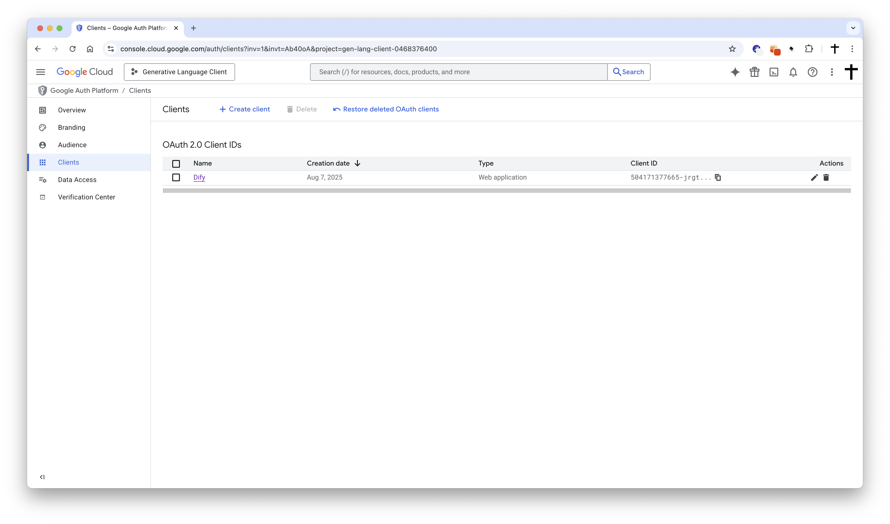
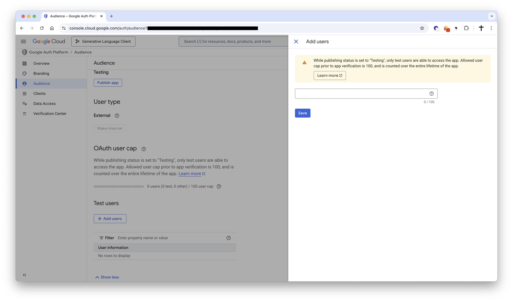

# Google Calendar Plugin

**Author**: langgenius
**Version**: 0.1.0
**Type**: tool

## Introduction

This plugin integrates with Google Calendar, supporting operations such as managing events, calendars, and scheduling. It enables automated calendar management in platforms like Dify.

## Setup

1. Register your application in the [Google Cloud Console](https://console.developers.google.com/).

2. Create a new application as follows:
    - **Project Name**: Dify Google Calendar Plugin
    - **Enable APIs**: Go to "APIs & Services" > "Library", search for and enable "Google Calendar API"

    

        
    

    - **Create Credentials**: Select "OAuth 2.0 Client ID"

    

        
    

    - **Application Type**: Choose "Web application"
    - **Redirect URI**: Set the redirect URI to:
        - For SaaS (cloud.dify.ai) users: please use `https://cloud.dify.ai/console/api/oauth/plugin/langgenius/google_calendar/google_calendar/tool/callback`
        - For self-hosted users: please use `http://<YOUR_LOCALHOST_CONSOLE_API_URL>/console/api/oauth/plugin/langgenius/google_calendar/google_calendar/tool/callback`
        ***Due to the restrictions of the Google OAuth2 flow, redirect URIs must start with `https://` or `http://localhost`.***

3. Copy your **Application (client) ID**

    

        
    

4. Create a new client secret:
    - **Description**: Dify Google Calendar Plugin Secret
    - **Expires**: Whatever duration you prefer (e.g., 1 year, 2 years, etc.)
    - Copy the generated **Value** of the client secret.

5. Add a test user to the Google Calendar API:
    - Go to "APIs & Services" > "Credentials" > "OAuth consent screen" > "Test Users"
    - Add a test user with the email address you want to use for testing.

    

        
    

6. Configure the plugin in Dify:
    - Fill in the **Client ID** and **Client Secret** fields with the values you copied from the Google Cloud Console.
    - Make sure you have the same redirect URI as specified in the Google Cloud Console. If not, you will need to update it in the Google Cloud Console.
    - Click `Save and authorize` to initiate the OAuth flow.

7. Enjoy using the Google Calendar plugin in Dify!

## Tool Descriptions

### list_calendars
Retrieve all Google Calendar calendars accessible to the current user.

**Features:**
- No parameters required
- Returns a list of all accessible calendars
- Includes primary and secondary calendars
- Provides detailed calendar information (ID, name, description, access permissions, etc.)

### list_events
Retrieve events from a specific calendar within a date range.

**Parameters:**
- calendar_id (string, optional): The ID of the calendar to list events from (use 'primary' for main calendar, default: 'primary')
- time_min (string, optional): Lower bound for event start time (ISO format, e.g., 2024-01-01T00:00:00Z)
- time_max (string, optional): Upper bound for event start time (ISO format, e.g., 2024-12-31T23:59:59Z)
- max_results (number, optional): Maximum number of events to return (1-2500, default: 10)
- show_deleted (boolean, optional): Whether to include deleted events (default: false)
- single_events (boolean, optional): Whether to expand recurring events into individual instances (default: true)
- order_by (select, optional): Order events by (startTime: start time, updated: last updated, default: startTime)

### create_event
Create a new event in the specified calendar.

**Parameters:**
- title (string, required): The title/summary of the event
- start_time (string, required): Event start time (ISO format, e.g., 2024-01-01T10:00:00Z)
- end_time (string, optional): Event end time (ISO format). If not provided, defaults to 1 hour after start time
- calendar_id (string, optional): The calendar ID to create the event in (use 'primary' for main calendar, default: 'primary')
- all_day (boolean, optional): Whether this is an all-day event (default: false)
- description (string, optional): Detailed description of the event
- location (string, optional): Event location (address, meeting room, etc.)
- attendees (array, optional): List of attendee email addresses
- time_zone (string, optional): Time zone for the event (e.g., America/New_York, Asia/Tokyo)
- visibility (select, optional): Event visibility setting (default: default, public: public, private: private, default: default)
- send_notifications (boolean, optional): Whether to send email notifications to attendees (default: true)

### search_events
Search for events in Google Calendar using text queries.

**Parameters:**
- query (string, required): Text to search for in event titles, descriptions, locations, or attendees
- calendar_id (string, optional): The calendar ID to search in (use 'primary' for main calendar, default: 'primary')
- time_min (string, optional): Lower bound for event start time (ISO format, e.g., 2024-01-01T00:00:00Z)
- time_max (string, optional): Upper bound for event start time (ISO format, e.g., 2024-12-31T23:59:59Z)
- max_results (number, optional): Maximum number of search results to return (1-250, default: 25)
- order_by (select, optional): Order search results by (startTime: start time, updated: last updated, default: startTime)
- show_deleted (boolean, optional): Whether to include deleted events in search results (default: false)
- single_events (boolean, optional): Whether to expand recurring events into individual instances (default: true)

## Privacy

When using this plugin, your Google Calendar data will be accessed through a secure OAuth connection. The plugin only accesses and operates on your calendar data within the scope you authorize. Please refer to Google's privacy policy for more information about data handling.

## Usage Examples

1. **Get Calendar List**: Use the `list_calendars` tool to view all available calendars
2. **View Today's Events**: Use the `list_events` tool with today's date range
3. **Create a Meeting**: Use the `create_event` tool to create a new meeting event with title, time, location, and attendees
4. **Search Specific Events**: Use the `search_events` tool to find relevant events by keywords

Last updated: August 7, 2025
