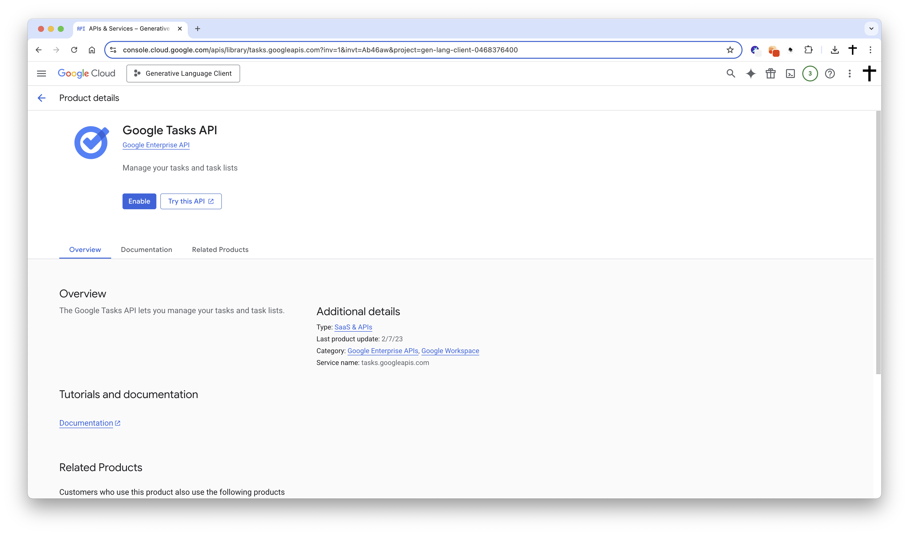
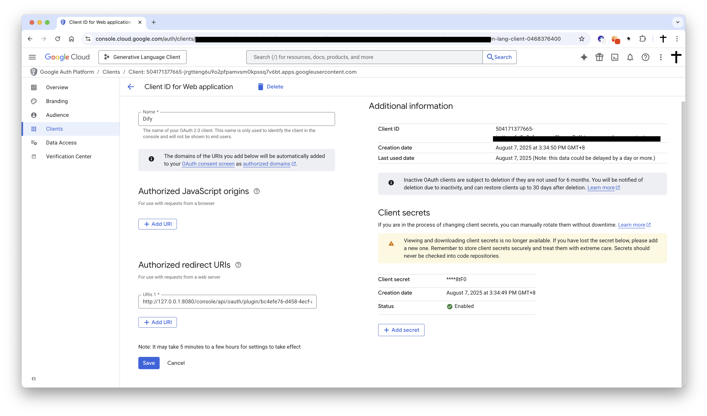

# Google Tasks Plugin

Author: langgenius  
Version: 0.1.0  
Type: tool (Dify plugin)

## Introduction

This plugin integrates with Google Tasks, enabling you to list task lists, fetch tasks, create and update tasks, delete tasks, and retrieve multiple tasks in batch. It is designed to work seamlessly within Dify to automate your personal or team task workflows.

## Prerequisites

- Dify v1.7.1 or later
- A Google Cloud project with OAuth 2.0 Client ID and Secret
- Google Tasks API enabled for your project

## Setup

1. Register your application in the [Google Cloud Console](https://console.developers.google.com/).

2. Create a new application as follows:
    - **Project Name**: Dify Google Tasks Plugin
    - **Enable APIs**: Go to "APIs & Services" > "Library", search for and enable "Google Tasks API"

    

        
    

    - **Create Credentials**: Select "OAuth 2.0 Client ID"

    

        
    

    - **Application Type**: Choose "Web application"
    - **Redirect URI**: Set the redirect URI to:
        - For SaaS (cloud.dify.ai) users: please use `https://cloud.dify.ai/console/api/oauth/plugin/langgenius/google_tasks/google_tasks/tool/callback`
        - For self-hosted users: please use `http://<YOUR_LOCALHOST_CONSOLE_API_URL>/console/api/oauth/plugin/langgenius/google_tasks/google_tasks/tool/callback`
        ***Due to the restrictions of the Google OAuth2 flow, redirect URIs must start with `https://` or `http://localhost`.***

3. Copy your **Application (client) ID**

    

        
    

4. Create a new client secret:
    - **Description**: Dify Google Tasks Plugin Secret
    - **Expires**: Whatever duration you prefer (e.g., 1 year, 2 years, etc.)
    - Copy the generated **Value** of the client secret.

5. Add a test user to the Google Tasks API:
    - Go to "APIs & Services" > "Credentials" > "OAuth consent screen" > "Test Users"
    - Add a test user with the email address you want to use for testing.

    

        
    

6. Configure the plugin in Dify:
    - Fill in the **Client ID** and **Client Secret** fields with the values you copied from the Google Cloud Console.
    - Make sure you have the same redirect URI as specified in the Google Cloud Console. If not, you will need to update it in the Google Cloud Console.
    - Click `Save and authorize` to initiate the OAuth flow.
## Available Tools

### list_tasklists
List all task lists in your Google Tasks account.

Parameters:
- max_results (number, optional, 1–100, default: 100): Maximum number of task lists to return.

Returns:
- task_lists (array): Task list objects (id, title, updated, ...)
- count (number): Total returned task lists

### list_tasks
List tasks from a specific task list.

Parameters:
- tasklist_id (string, optional, default: `@default`): The task list ID (`@default` for the default list).
- max_results (number, optional, 1–100, default: 100): Maximum number of tasks to return.
- show_completed (boolean, optional, default: true): Include completed tasks.
- show_deleted (boolean, optional, default: false): Include deleted tasks.
- show_hidden (boolean, optional, default: false): Include hidden tasks.
- due_min (string, optional): RFC 3339 timestamp for minimum due date.
- due_max (string, optional): RFC 3339 timestamp for maximum due date.
- completed_min (string, optional): RFC 3339 timestamp for minimum completed time.
- completed_max (string, optional): RFC 3339 timestamp for maximum completed time.

Returns:
- tasks (array): Task objects
- count (number): Number of tasks returned
- tasklist_id (string): The task list ID queried

### create_task
Create a new task.

Parameters:
- title (string, required): Task title.
- tasklist_id (string, optional, default: `@default`): Target task list.
- notes (string, optional): Additional notes/description.
- due_date (string, optional): Due date in `YYYY-MM-DD` or RFC 3339 format.
- parent_task_id (string, optional): Parent task ID for creating a subtask.
- previous_task_id (string, optional): Insert the new task after this task.

Returns:
- task (object): The created task
- success (boolean)
- message (string)

### update_task
Update properties of an existing task.

Parameters:
- task_id (string, required): ID of the task to update.
- tasklist_id (string, optional, default: `@default`)
- title (string, optional)
- notes (string, optional)
- due_date (string, optional): `YYYY-MM-DD` or RFC 3339. Use empty string `""` to remove the due date.
- completed (boolean, optional): Mark as completed or incomplete.
- deleted (boolean, optional): Mark as deleted.

Returns:
- task (object): The updated task
- success (boolean)
- message (string)

### delete_task
Delete a task.

Parameters:
- task_id (string, required)
- tasklist_id (string, optional, default: `@default`)

Returns:
- success (boolean)
- message (string)
- deleted_task_id (string)
- deleted_task_title (string)

### get_task
Get details of a specific task.

Parameters:
- task_id (string, required)
- tasklist_id (string, optional, default: `@default`)

Returns:
- task (object)
- success (boolean)

### batch_get_tasks
Retrieve multiple tasks at once by their IDs.

Parameters:
- task_ids (string, required): Task IDs separated by comma, semicolon, or newline.
- tasklist_id (string, optional, default: `@default`)

Returns:
- tasks (array)
- count (number): Number of tasks successfully retrieved
- requested (number): Number of tasks requested
- success (boolean)
- errors (array, optional): Items with `task_id` and `error` message

## Notes

- All endpoints require prior authorization. Ensure you have completed the OAuth flow.
- Date fields accept RFC 3339 timestamps. For convenience, `YYYY-MM-DD` is also supported where noted.
- The special task list ID `@default` refers to your default task list.

## Privacy

This plugin uses OAuth 2.0 to access your Google Tasks data over HTTPS and only within the scope you authorize (`https://www.googleapis.com/auth/tasks`). Access tokens and refresh tokens are stored securely by Dify for the purpose of providing the tool functionality.

## Troubleshooting

- 401 Unauthorized: Re-authorize the plugin (access token expired or invalid).
- 403 Forbidden: Ensure “Google Tasks API” is enabled and the requested scope matches.
- 404 Not Found: Verify the `tasklist_id` or `task_id` you provided.
- Network errors: Check your network connectivity and firewall settings.

Last updated: August 8, 2025