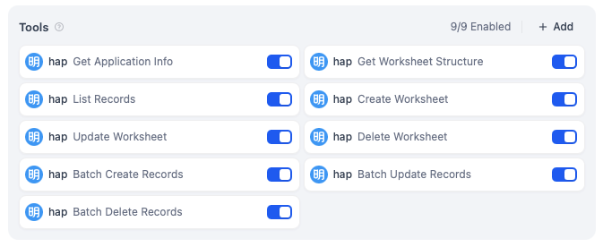
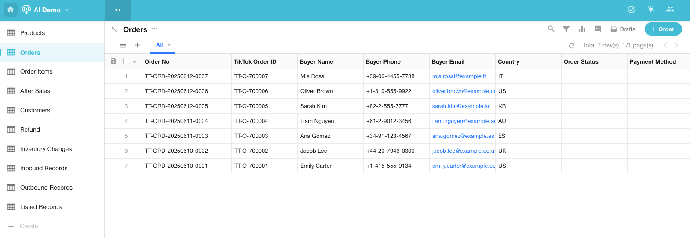

# HAP 应用工具

欢迎使用 **HAP**（Hyper Application Platform）的 **Dify** 插件，它将连接您的 **HAP** 应用至 **Dify**，为应用注入丰富的 AI 使用场景。

## 使用场景示例

### AI 创建应用：“创建一个 TikTok 订单及售后管理系统”

配置下面的 9 个工具，你可以在 Dify 快速建立一个 `HAP App Builder Agent`。配置好Agent之后，就可以通过对话创建应用并快速生成示例数据。

你可以用下面的对话来让 AI 帮你创建一个 TikTok 的订单管理系统：

> 为 TikTok 电商平台创建一个产品、订单和售后管理系统，并生成一批样本测试数据。

AI 会自动创建相互关联的 TikTok 业务工作表，并在创建完成后生成一批测试数据，像真实的一样！

### AI 应用数据管理：“告诉我Q2卖得最好的商品前3名是什么”

配置下面的工具，我们可以创建一个管理应用数据的Agent，可以对应用内的数据进行查询、统计以及增删改。

**查询示例：**

> 1. 告诉我Q2卖得最好的商品前3名是什么？
> 2. 过去30天内哪个商品类目的退货率最高？
> 3. 统计一下复购率最高的前5名客户，显示他们的购买次数和总消费金额
> 4. 帮我把今天的售后单都标记为“已完成”

## Tools / 工具列表

- **get_app_info**: 获取应用信息
- **get_worksheet_structure**: 获取工作表结构
- **list_records**: 查询工作表行记录列表
- **get_record_pivot**: 获取记录透数据
- **create_record**: 新建记录
- **update_record**: 更新记录
- **delete_record**: 删除记录
- **get_record**: 获取记录详情
- **public_find_member**: 查找成员
- **public_find_department**: 查找部门
- **public_get_regions**: 获取地区/城市ID
- **batch_create_records**: 批量创记录
- **batch_update_records**: 批量更记录
- **batch_delete_records**: 批量删记录
- **get_record_discussions**: 取记录讨论
- **get_record_logs**: 获取记录日志
- **get_record_relations**: 获取记关联
- **get_record_share_link**: 获取录分享链接
- **create_worksheet**: 新建工作表
- **update_worksheet**: 编辑工作表
- **delete_worksheet**: 删除工作表
- **list_workflows**: 获取工作流列表
- **get_workflow**: 获取工作流详情
- **trigger_workflow**: 触发工作流
- **list_roles**: 获取角色列表
- **get_role**: 获取角色详情
- **create_role**: 创建角色
- **delete_role**: 删除角色
- **add_role_members**: 添加角色成员
- **remove_role_members**: 移除角色员
- **user_leave_all_roles**: 成员退所有角色
- **list_optionsets**: 获取选项集列表
- **create_optionset**: 创建选项集
- **update_optionset**: 更新选项集
- **delete_optionset**: 删除选项集

## 快速开始

1. 从 [https://www.mingdao.com/register](https://www.mingdao.com/register) 免费注册一个用户，并创建一个 HAP 应用。
2. 在 **HAP** 应用管理菜单里，从 `API Developer Docs` 复制应用的 `Appkey` 和 `Sign`。
3. 从市场安装 `HAP 应用工具` 插件。
4. 在插件管理页面中将 `AppKey` 和 `Sign` 配置到插件的 `API Key 授权配置` 中。
5. 你可以通过创建新的授权配置来连接多个 **HAP** 应用，在 **Dify** 中使用时切换不同的凭据即可。
6. 在工作流中使用 `HAP 应用工具`，直接在画布中添加节点即可。
7. 在 Agent 中使用 `HAP 应用工具`，直接把插件配置为 Agent 的工具即可。不过由于插件工具数量比较多，要注意工具的能力范围，根据 Agent 的用途挑选最合适的工具。
