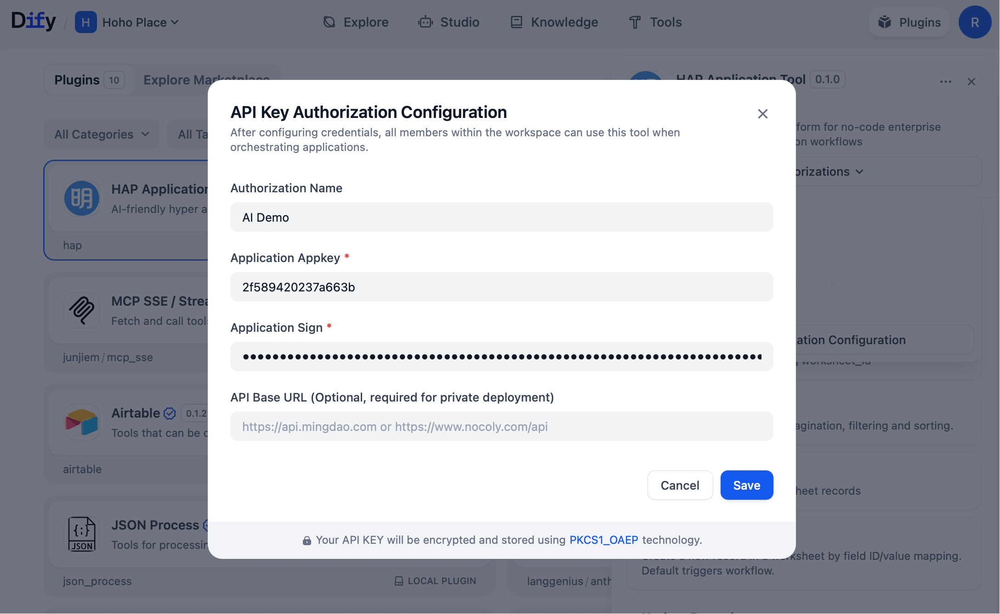
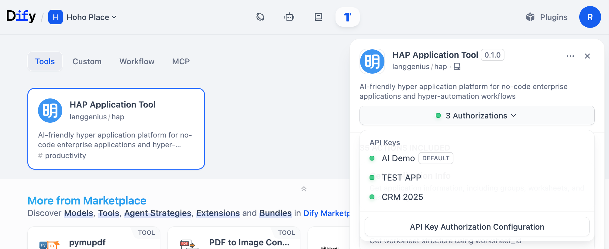
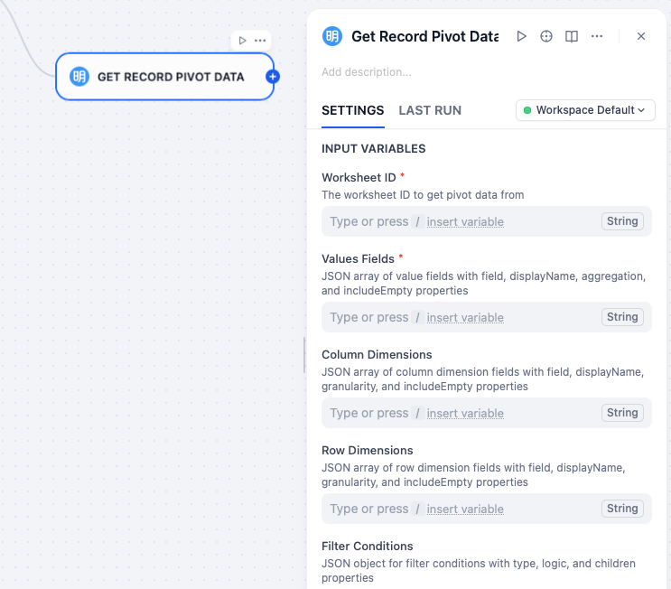

# HAP Application Tool

Welcome to the **HAP** (Hyper Application Platform) **Dify** Plugin, which seamlessly connects your **HAP** applications to **Dify**, enriching your applications with comprehensive AI-powered scenarios.

## Use Case Examples

### AI Application Creation: "Create a management system for TikTok orders and after-sales."

By configuring the following 9 tools, you can create a `HAP App Builder Agent` in **Dify**. Once the Agent is properly configured, you can create applications through conversational interactions and rapidly generate sample data.

You can use the following prompt to have AI create a TikTok order management system for you:

> Create a product, order, and after-sales management system for a TikTok e-commerce platform, and generate a batch of sample test data.

The AI will automatically create interconnected TikTok business worksheets and generate realistic test data upon completion!

### AI Application Data Management: "Tell me the top 3 best-selling products in Q2"

By configuring the tools below, we can create an Agent for managing application data, capable of querying, analyzing, and performing CRUD operations on data within the application.

**Query examples:**

> 1. What are the top 3 best-selling products in Q2?
> 2. Which product category has the highest return rate in the past 30 days?
> 3. Analyze the top 5 customers with the highest repurchase rates, showing their purchase frequency and total spending.
> 4. Mark all today's after-sales orders as "Completed".

## Tools

- **get_app_info**: Get Application Info
- **get_worksheet_structure**: Get Worksheet Structure
- **list_records**: List Records
- **get_record_pivot**: Get Record Pivot Data
- **create_record**: Create Record
- **update_record**: Update Record
- **delete_record**: Delete Record
- **get_record**: Get Record Details
- **public_find_member**: Find Member
- **public_find_department**: Find Department
- **public_get_regions**: Get Regions/Citys
- **batch_create_records**: Batch Create Records
- **batch_update_records**: Batch Update Records
- **batch_delete_records**: Batch Delete Records
- **get_record_discussions**: Get Record Discussions
- **get_record_logs**: Get Record Logs
- **get_record_relations**: Get Record Relations
- **get_record_share_link**: Get Record Share Link
- **create_worksheet**: Create Worksheet
- **update_worksheet**: Update Worksheet
- **delete_worksheet**: Delete Worksheet
- **list_workflows**: List Workflows
- **get_workflow**: Get Workflow Details
- **trigger_workflow**: Trigger Workflow
- **list_roles**: List Roles
- **get_role**: Get Role Details
- **create_role**: Create Role
- **delete_role**: Delete Role
- **add_role_members**: Add Role Members
- **remove_role_members**: Remove Role Members
- **user_leave_all_roles**: User Leave All Roles
- **list_optionsets**: List Option Sets
- **create_optionset**: Create Option Set
- **update_optionset**: Update Option Set
- **delete_optionset**: Delete Option Set

## Getting Started

1. Register for a free account at [https://www.mingdao.com/register](https://www.mingdao.com/register) and create a **HAP** application.
2. In the **HAP** application management, copy the application's `AppKey` and `Sign` from `API Developer Docs`.
3. Install the `HAP Application Tool` plugin from the Marketplace.
4. Configure the `AppKey` and `Sign` in the plugin's `API Key Authorization` on the Plugins page.

5. You can connect multiple **HAP** applications by creating new authorizations and switch between different authorizations when using them in **Dify**.

6. To use `HAP Application Tool` in workflows, simply add nodes directly on the canvas:

7. To use `HAP Application Tool` in an Agent, simply configure the plugin as the Agent's tool. However, given the extensive number of plugin tools available, it's important to consider the scope of tool capabilities and select the most appropriate tools based on the Agent's intended purpose.
