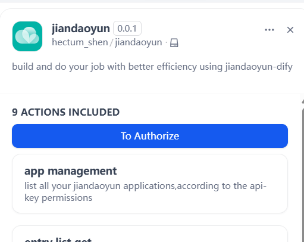
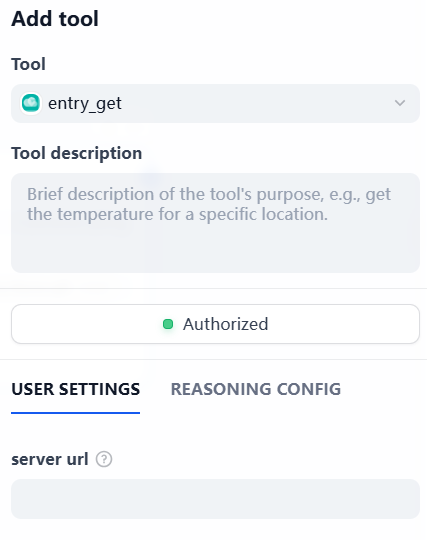
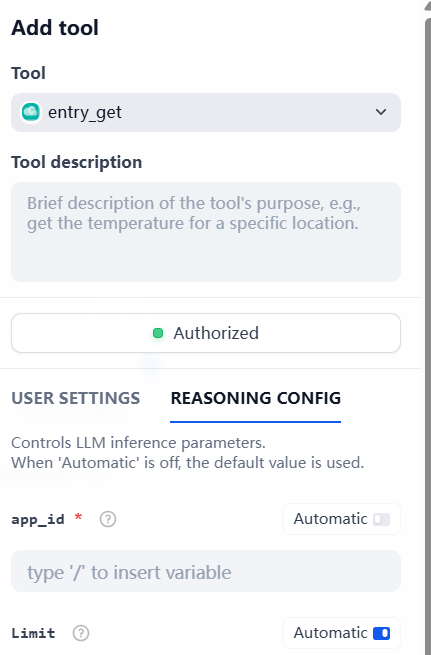

# Dify plugin for Jiandaoyun

**Author:** jiandaoyun  
**Version:** 0.0.1  
**Type:** tool  

## Description

The Jiandaoyun Dify plugin provides basic API capabilities for Jiandaoyun forms, supporting fundamental operations such as querying applications, forms, and form data, as well as creating, updating, and deleting form data.
The plugin is designed to support better corperate management and data collection, allowing users to easily manage forms and data on the Jiandaoyun platform with dify.

## Installation and Usage  

### Prerequisites  
No specific prerequisites.

### Obtaining an API Key
To obtain an API key, visit the [Jiandaoyun Open Platform](http://jiandaoyun.com/open#/key/api_key) to create one. For detailed creation guidelines and usage instructions, refer to the [Jiandaoyun documentation](https://hc.jiandaoyun.com/open/11498).

### Plugin Installation and Configuration
To start using the Jiandaoyun Dify plugin, ensure you have installed it from the marketplace and configured it with your API key

1.Open the PLUGINS page ,click the "Jiandaoyun" plugin, and you will see the following interface:



2.click To Authorize, fill in your API key(if you don't have one, please refer to the "Installation and Usage" section below to obtain it), and then click "Save".Then you've get your apiKey configured.
3.If you are using the self-hosted version of Jiandaoyun, you also need to fill in the server url in the "Server URL" field. If you are using the official Jiandaoyun API center, just fill in "https://api.jiandaoyun.com/api".
4.Then you can use the plugin in your conversations by invoking its functions. For example, to query all applications, you can say:
```"Use the Jiandaoyun plugin to query all applications."```
To create a new record in a specific form, you can prompt:
"Use the Jiandaoyun plugin to create a new record in the form with entry_id 'your_entry_id' and app_id 'your_app_id', with the following data: {field1: value1, field2: value2}."


4.then use an agent which can call the tool to complete the operation.
Before the agent works, you should fill in the neceesary fields(the server url if you are not using the official jiandaoyun api center; app_id and entry_id if necessary):



5.You should also tell the agent your app_id in reasoning config:



then the plugin will work well.

## Core Features

### 1. Query All Applications (App Management)  
This function retrieves information about all forms accessible to the user holding the API key. The response is returned in both text and JSON formats, including the form name and entry_id.

### 2. Create a Single Record (Create Data)  
This function allows adding a new record to a specified form. The response is returned in both text and JSON formats, including the ID of the newly created record and the full content of the created data (invalid or format-incompatible fields will be automatically set to empty).

### 3. Query a Single Record (Query Data)  
Using a specific data_id, along with the entry_id and app_id, this function retrieves a specified single record. The response is returned in both text and JSON formats, containing the detailed content of the data.

### 4. Update a Single Record (Update Data)  
Using a specific data_id, along with the entry_id and app_id, this function updates a specified single record. The response is returned in both text and JSON formats, including the updated content and information about the updater.

### 5. Delete a Single Record (Delete Data)  
Deletes a single record with the specified data_id.

### 6. Query All Forms (Query Forms)  
Given a provided app_id, this function retrieves information about all forms within the specified application. The response is returned in both text and JSON formats, including form names and entry_ids. Pagination is supported using the `limit` and `offset` parameters.

### 7. Query Multiple Records (Query Data List)  
Using app_id and entry_id, this function performs batch queries on data within a specified form. You can use the `fields` parameter to specify which fields to retrieve (as an array) and the `filter` parameter to apply conditional filtering.

### 8. Query Form Fields (Query Widgets)  
Using app_id and entry_id, this function retrieves information about all fields within a specified form. The response is returned in both text and JSON formats, including field name, type, and whether the field is required.