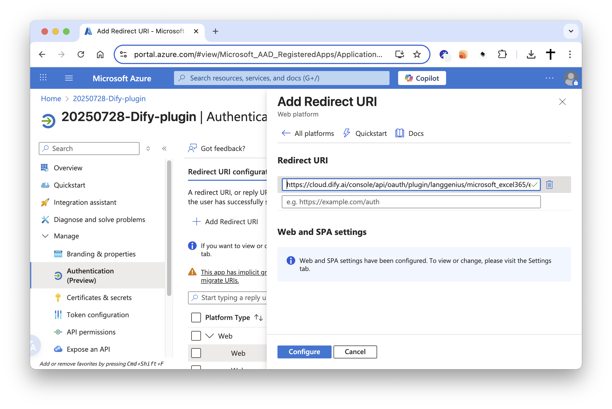
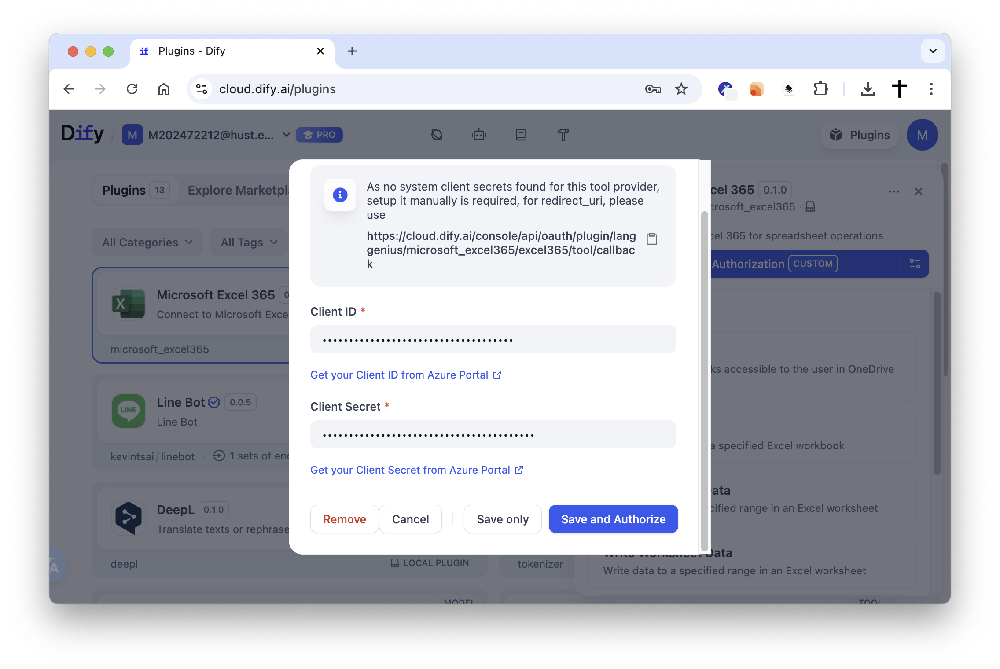

# Microsoft Excel 365 Plugin

**Author**: langgenius  
**Version**: 0.1.0  
**Type**: tool  

## Introduction

This plugin integrates with Microsoft Excel 365, supporting comprehensive spreadsheet operations through Microsoft Graph API. It enables automated management of Excel workbooks and worksheets in platforms like Dify, allowing you to read, write, and manipulate Excel data seamlessly.

## Features

This plugin supports comprehensive Excel 365 operations including:

- **File Management**: List all files and folders in OneDrive with filtering options
- **Workbook Management**: List, browse and search Excel workbooks in OneDrive/SharePoint
- **Worksheet Operations**: Create, list and manage worksheets within workbooks
- **Data Reading**: Read cell values from specified ranges with flexible range selection
- **Data Writing**: Update or insert data into cells with 2D array support
- **Data Clearing**: Remove content from specified cell ranges
- **Data Search**: Find specific values within worksheets and get their locations

## Setup

1. Register your application in the [Microsoft Azure Portal](https://portal.azure.com/#view/Microsoft_AAD_RegisteredApps/ApplicationsListBlade).

2. Create a new application as follows:
    - **Name**: Dify Excel 365 Plugin
    - **Supported account types**: select `Accounts in any organizational directory (Any Microsoft Entra ID tenant - Multitenant) and personal Microsoft accounts (e.g. Skype, Xbox)`
    - **Redirect URI**: Choose `Web` and set the URI to:
        - For SaaS (cloud.dify.ai) users: please use `https://cloud.dify.ai/console/api/oauth/plugin/langgenius/microsoft_excel365/excel365/tool/callback`
        - For self-hosted users: please use `http://<YOUR LOCALHOST CONSOLE_API_URL>/console/api/oauth/plugin/langgenius/microsoft_excel365/excel365/tool/callback`
        ***Due to the restrictions of the Microsoft OAuth2 flow, redirect URIs must start with `https://` or `http://localhost`.***
        - Enable "Access tokens" and "ID tokens" under "Implicit grant and hybrid flows"

3. Copy your **Application (client) ID**

4. Create a new client secret:
    - **Description**: Dify Excel 365 Plugin Secret
    - **Expires**: Whatever duration you prefer (e.g., 1 year, 2 years, etc.)
    - Copy the generated **Value** of the client secret.

5. Configure API Permissions:
    - Go to "API permissions"
    - Click "Add a permission" → "Microsoft Graph"
    - Add the following permissions:
        - `Files.ReadWrite` (Delegated)
        - `offline_access` (Delegated)
    - Grant admin consent if required

6. Configure the plugin in Dify:
    - Fill in the **Client ID** and **Client Secret** fields with the values you copied from the Azure Portal.
    - Make sure you have the same redirect URI as specified in the Azure Portal. If not, you will need to update it in the Azure Portal.
    - Click `Save and authorize` to initiate the OAuth flow.

7. Enjoy using the Microsoft Excel 365 plugin in Dify!

## Scopes (Hard-coded)

The plugin uses the following Microsoft Graph scopes (hard-coded in the provider):
- `Files.ReadWrite`: Read and write user's files
- `offline_access`: Maintain access to data you have given it access to
- `Sites.Read.All`: Read SharePoint site collections and related files/drives (required for accessing SharePoint Site drives)

Note: Scopes are defined in `provider/microsoft_excel365.py` and requested during OAuth.

## SharePoint Site Support (site_id)

By default, all tools operate on the signed-in user’s OneDrive using the Graph endpoint `…/me/drive`.

If you need to access or edit files that live under a SharePoint Site, you can provide an optional parameter `site_id` to target that Site’s drive. When `site_id` is present, the tools will switch to the Graph endpoint `…/sites/{site_id}/drive`.

- When to use: only when you need to access/edit content inside a SharePoint Site.
- How to find: obtain the Site’s ID from Microsoft Graph or the SharePoint admin/UI as appropriate. Quick tip: append `/_api/site/id` to your SharePoint site URL (e.g., `https://yourdomain.sharepoint.com/sites/YourSite/_api/site/id`) to get the `site_id`.

Tools that accept `site_id` (optional):
- list_all_files
- list_workbooks
- list_worksheets
- read_worksheet_data
- write_worksheet_data
- clear_worksheet_data
- create_worksheet
- search_worksheet_data

## Tool Descriptions

### list_all_files
List all files and folders in OneDrive with optional filtering.

**Parameters:**
- site_id (string, optional): Only required when accessing a SharePoint Site drive.
- folder_path (string, optional): The folder path to list (use 'root' for root folder, 'recent' for recent files, or 'id:FOLDER_ID' for specific folder). Default is "root".
- file_type (select, optional): Filter by file type. Options: "all", "excel", "folders". Default is "all".
- max_results (number, optional): Maximum number of items to return (default: 50, max: 200).

### list_workbooks
List all Excel workbooks accessible to the user in OneDrive or SharePoint.

**Parameters:**
- site_id (string, optional): Only required when accessing a SharePoint Site drive.
- folder_id (string, optional): The ID of the folder to list workbooks from.
- search_query (string, optional): Search for workbooks by name.
- max_results (number, optional): Maximum number of workbooks to return (default: 20, max: 100).

### list_worksheets
List all worksheets in a specified Excel workbook.

**Parameters:**
- site_id (string, optional): Only required when accessing a SharePoint Site drive.
- workbook_id (string): The ID of the Excel workbook.

### read_worksheet_data
Read data from a specified range in an Excel worksheet.

**Parameters:**
- site_id (string, optional): Only required when accessing a SharePoint Site drive.
- workbook_id (string): The ID of the Excel workbook.
- worksheet_name (string): The name of the worksheet to read from.
- range (string, optional): The cell range to read (e.g., A1:D10). Default is A1:Z100.

### write_worksheet_data
Write data to a specified range in an Excel worksheet.

**Parameters:**
- site_id (string, optional): Only required when accessing a SharePoint Site drive.
- workbook_id (string): The ID of the Excel workbook.
- worksheet_name (string): The name of the worksheet to write to.
- range (string): The cell range to write to (e.g., A1:D10).
- values (string): The values to write as a 2D array in JSON format.

### clear_worksheet_data
Clear data from a specified range in an Excel worksheet.

**Parameters:**
- site_id (string, optional): Only required when accessing a SharePoint Site drive.
- workbook_id (string): The ID of the Excel workbook.
- worksheet_name (string): The name of the worksheet to clear data from.
- range (string): The cell range to clear (e.g., A1:D10).

### create_worksheet
Create a new worksheet in an Excel workbook.

**Parameters:**
- site_id (string, optional): Only required when accessing a SharePoint Site drive.
- workbook_id (string): The ID of the Excel workbook.
- worksheet_name (string): The name for the new worksheet.

### search_worksheet_data
Search for specific values in an Excel worksheet.

**Parameters:**
- site_id (string, optional): Only required when accessing a SharePoint Site drive.
- workbook_id (string): The ID of the Excel workbook.
- worksheet_name (string): The name of the worksheet to search in.
- search_value (string): The value to search for.
- range (string, optional): The cell range to search in (e.g., A1:Z1000). Default is A1:Z1000.

## PRIVACY

Please refer to the [Privacy Policy](PRIVACY.md) for information on how your data is handled when using this plugin.

Last updated: August 11, 2025
