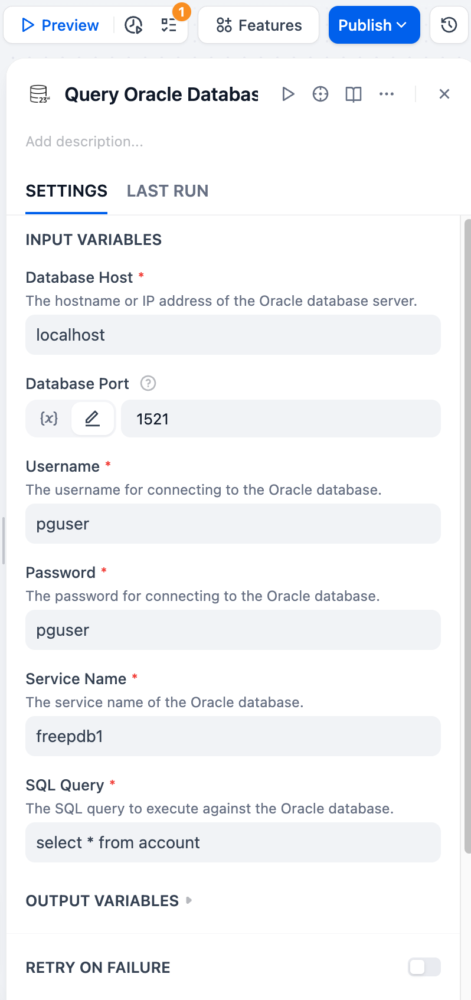
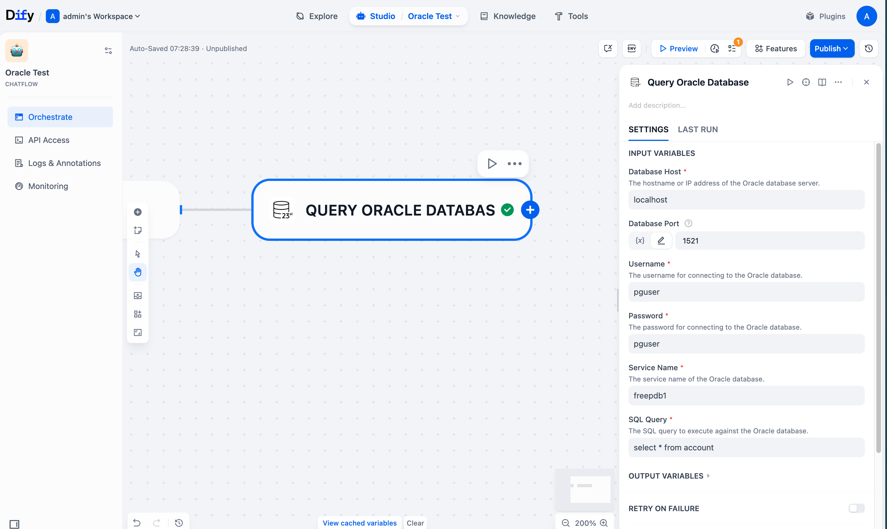
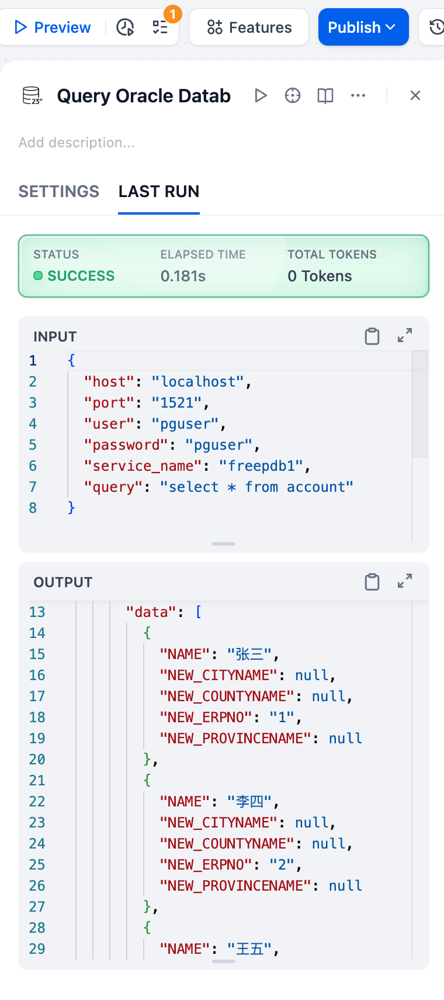

## Oracle Database Query Plugin

**Author:** langgenius
**Version:** 0.0.2
**Type:** tool
**Repo:** [https://github.com/WilburOracle/dify-oracle-db-plugin](https://github.com/WilburOracle/dify-oracle-db-plugin)

### Description

This plugin allows you to connect to Oracle databases (Oracle Database 23ai) and execute SQL queries. It provides a simple interface to query Oracle databases directly from Dify.

### Features

- Connect to Oracle databases using Thin Mode (no need for Oracle client installation)
- Execute SQL queries and retrieve results in a structured format
- Support for common Oracle data types
- Error handling and detailed error messages
- Oracle is a converged database, this plugin can execute multi-modal SQL, including relational data queries, property graph data queries, JSON document data queries, vector data queries, etc.

### Parameters

When using this plugin, you need to provide the following parameters:

| Parameter | Type | Required | Description |
|-----------|------|----------|-------------|
| host | String | Yes | The hostname or IP address of the Oracle database server |
| port | Integer | Yes | The port number of the Oracle database server (default is 1521) |
| user | String | Yes | The username for connecting to the Oracle database |
| password | String | Yes | The password for connecting to the Oracle database |
| service_name | String | Yes | The service name of the Oracle database |
| query | String | Yes | The SQL query to execute against the Oracle database |




### Example Usage

```sql
-- Example query to get data from a table
SELECT * FROM employees WHERE department = 'IT' LIMIT 10;
```




### Return Format

The plugin returns results in JSON format with the following structure:

```json
{
  "status": "success",
  "data": [
    {"column1": "value1", "column2": "value2"}, 
    {"column1": "value3", "column2": "value4"}
  ],
  "columns": ["column1", "column2"],
  "message": "Query executed successfully, returned 2 rows."
}
```



In case of an error, the response will be:

```json
{
  "status": "error",
  "message": "Error description"
}
```

### Privacy Note

This plugin only executes SQL and returns results to Dify workflows. It does not actively or passively collect user information.