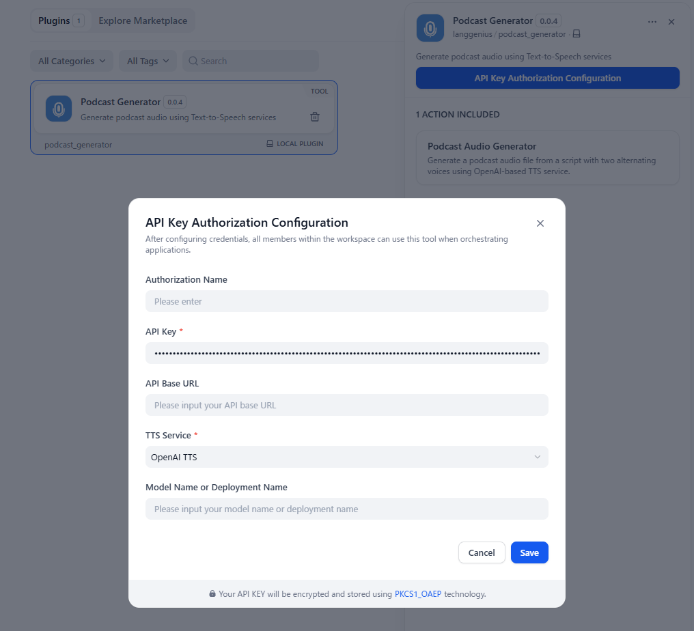
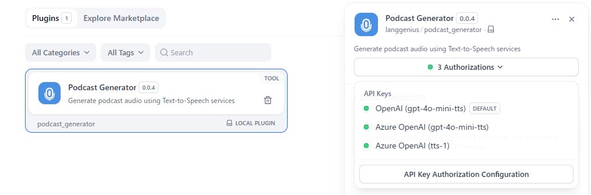
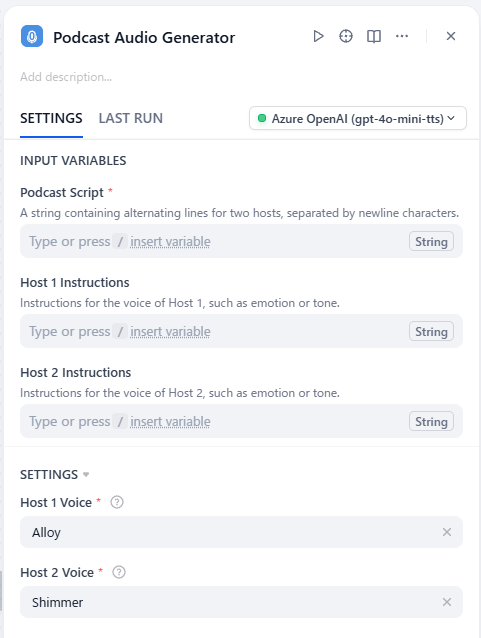

## Overview

**Podcast Generator** is a powerful tool for creating podcast audio files using Text-to-Speech (TTS) services. This tool can generate a podcast with alternating voices by providing a script, making it ideal for dialogue-based content, interviews, or storytelling.

Powered by OpenAI-based TTS services, Podcast Generator simplifies the production of high-quality audio content. Currently this tool supoorts following TTS services:

- OpenAI TTS (and other OpenAI-compatible TTS services)
- Azure OpenAI TTS

You can specify the TTS models, voices, and instructions used for each host in the podcast, allowing for a personalized touch to your audio content.

## Configuration

To start using Podcast Generator, follow these steps:

1. **Get an API Key for your TTS Service**
   Depending on the TTS service you want to use (for example, [OpenAI](https://platform.openai.com/)), create a new API Key, and ensure that your account is properly set up with sufficient access.
2. **Install the Podcast Generator Tool**
   Open the Plugin Marketplace, search for the Podcast Generator tool, and install it to integrate it with your application.
3. **Authorize Podcast Generator**
   Go to **Plugins > Podcast Generator > Authorize**.  
   Enter your API Key to activate the tool. Here's a minimal example of how to set up the tool:  
   

You can authorize multiple TTS services or models by repeating the authorization process for each service or model you want to use.  
It's recommended to name each authorization entry by **Authorization Name** field, so you can easily identify which TTS service or model to use later.  

**Note**: If you select **OpenAI TTS** and leave the **Model Name** field empty, it's defaulted to `tts-1`. If you select **Azure OpenAI TTS**, the **API Base URL** and **Deployment Name** fields are required.

## Tool Feature

The **Podcast Audio Generator** action converts your text script into a podcast audio file using two alternating voices.

1. **Input the Podcast Script**
   Provide a script containing alternating lines for two hosts, separated by newline characters. Each line corresponds to what one of the hosts will say.
2. **Select Host Voices**
   Choose a voice for **Host 1** and **Host 2** from the available options. These voices will be used to narrate the respective lines in the script.  
   Optionally, you can also specify the **Instructions** for each host to guide the tone or style of their narration.
3. **Generate the Podcast Audio**
   Once the script and voices are set, run the action to create your podcast audio file. The result will combine the two voices, alternating as per the script.

## Usage

Podcast Generator can seamlessly integrate **Chatflow / Workflow Apps** and **Agent Apps**.

### Chatflow / Workflow Apps

1. Add the Podcast Generator node to your Chatflow or Workflow pipeline.
2. Input the podcast script in the node configuration.
3. Run the pipeline to generate and deliver the podcast audio as part of the workflow.

### Agent Apps

1. Add the Podcast Generator tool to your Agent application.
2. Send a podcast script via the chat interface.
3. The tool processes the script and returns the generated audio file to the user.

## Use Cases

- **Podcast Creation**: Quickly produce podcasts for storytelling, interviews, or educational content.
- **Dialogue Simulations**: Generate podcasts with alternating voices to mimic conversations or debates.
- **Marketing Content**: Create engaging audio advertisements or announcements.
- **Content Accessibility**: Provide audio versions of written content for visually impaired audiences.

The Podcast Generator makes podcast production efficient and accessible, enabling creators to focus on crafting compelling scripts while automating the audio generation process.
