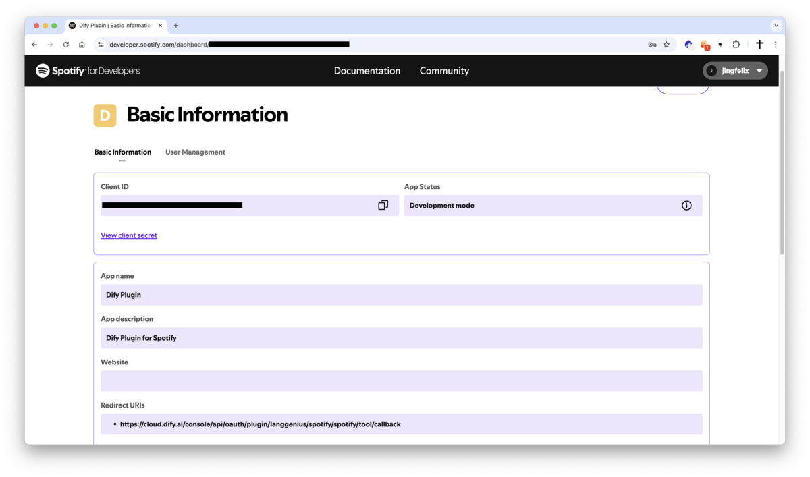

# Spotify Plugin

**Author**: langgenius
**Version**: 0.1.1
**Type**: tool

## Introduction

This plugin integrates with Spotify, supporting operations such as searching for music, controlling playback, managing playlists, and retrieving detailed information about tracks, albums, and artists. It enables automated music discovery and playback control in platforms like Dify.

## Setup

1. Go to the [Spotify Developer Dashboard](https://developer.spotify.com/dashboard/applications) and log in with your Spotify account.

2. Create a new app:
    - **App name**: Dify Spotify Plugin
    - **App description**: Integration with Dify for music search and playback control
    - **Website**: (optional) Your website URL
    - **API Used**: Web API
    - **Redirect URI**: Set the URI to:
        - For SaaS (cloud.dify.ai) users: please use `https://cloud.dify.ai/console/api/oauth/plugin/langgenius/spotify/spotify/tool/callback`
        - For self-hosted users: please use `http://<YOUR LOCALHOST CONSOLE_API_URL>/console/api/oauth/plugin/langgenius/spotify/spotify/tool/callback`
        ***Redirect URIs must be exact matches including the protocol (https:// or http://127.0.0.1).***
    - Due to the restrction of Spotify, developer can only create Apps in Developer Mode by default. You need manage the Spotify users you want to allow access to your app manually.

3. After creating the app, you'll see your app's details page. Copy your **Client ID**.

4. Click on "View Client Secret" to reveal your **Client Secret**. Copy this value.

6. Configure the plugin in Dify:
    - Fill in the **Client ID** and **Client Secret** fields with the values you copied from the Spotify Developer Dashboard.
    - Make sure you have the same redirect URI as specified in your Spotify app settings.
    - Click `Save and authorize` to initiate the OAuth flow.

7. Enjoy using the Spotify plugin in Dify!

## Tool Descriptions

### spotify_search
Search for tracks, albums, artists, and playlists on Spotify with customizable filters.

**Parameters:**
- query (string): The search term (song title, artist name, album name, etc.)
- type (select): Type of content to search for (track, album, artist, playlist, or combinations)
- limit (number): Maximum number of results to return (1-50, default: 20)
- market (string): ISO 3166-1 alpha-2 country code to limit search results by market

### spotify_get_track
Get detailed information about a specific Spotify track including audio features.

**Parameters:**
- track_id (string): The Spotify ID of the track to retrieve
- include_audio_features (boolean): Whether to include audio features like danceability, energy, etc.

### spotify_get_album
Retrieve comprehensive information about a Spotify album including all tracks.

**Parameters:**
- album_id (string): The Spotify ID of the album to retrieve
- include_tracks (boolean): Whether to include the full track listing
- market (string): ISO 3166-1 alpha-2 country code for market-specific information

### spotify_get_artist
Get detailed information about a Spotify artist including top tracks and related artists.

**Parameters:**
- artist_id (string): The Spotify ID of the artist to retrieve
- include_top_tracks (boolean): Whether to include the artist's top tracks
- include_albums (boolean): Whether to include the artist's albums
- include_related_artists (boolean): Whether to include related artists
- market (string): ISO 3166-1 alpha-2 country code for market-specific information

### spotify_control_playback
Control Spotify playback including play, pause, skip, volume control, and device management. *Note that this feature requires a Spotify Premium account.*

**Parameters:**
- action (select): The playback action to perform:
  - `play`: Start or resume playback
  - `pause`: Pause playback
  - `next`: Skip to next track
  - `previous`: Skip to previous track
  - `volume`: Set volume level
  - `shuffle`: Toggle shuffle mode
  - `repeat`: Set repeat mode
  - `transfer`: Transfer playback to different device
- track_uri (string): Spotify URI of track to play (for play action)
- volume_percent (number): Volume level 0-100 (for volume action)
- shuffle_state (boolean): Enable/disable shuffle (for shuffle action)
- repeat_state (select): Repeat mode - off, track, context (for repeat action)
- device_id (string): Target device ID (for transfer action)

### spotify_list_devices
List all available Spotify devices for the current user.

**Parameters:**
- None

Last updated: January 2025
