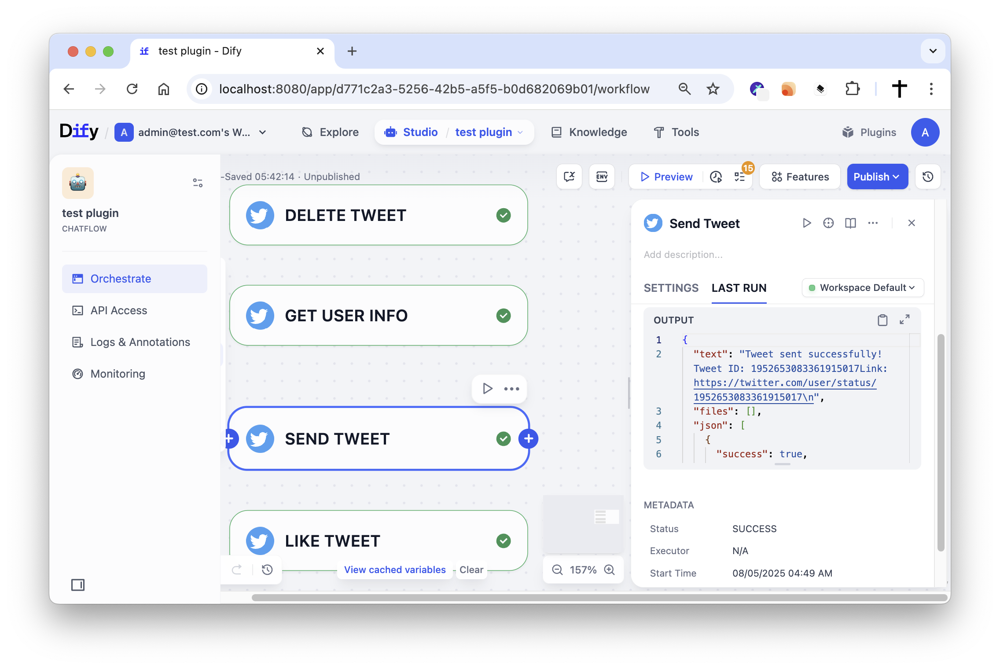
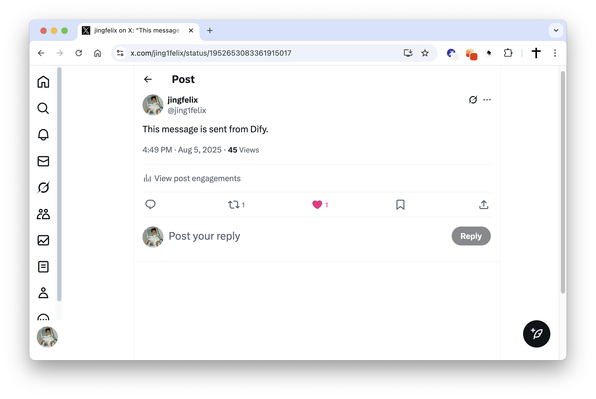

# Twitter Plugin

**Author**: langgenius  
**Version**: 0.1.1  
**Type**: tool

## Introduction

This plugin integrates with Twitter (X), enabling automated management of your Twitter account through platforms like Dify. It supports essential Twitter operations including posting tweets, liking posts, retrieving user information, and deleting tweets.

## Setup

1. Create a Twitter Developer Account and register your application at [Twitter Developer Portal](https://developer.twitter.com/en/portal/dashboard).

2. Create a new Twitter app with the following settings:
    - **App Name**: Dify Twitter Plugin
    - **App Description**: Integration plugin for Dify platform
    - **Website URL**: Your website or application URL
    - **App Type**: Choose "Web App, Automated App or Bot"
    - **App Permissions**: Set to "Read and Write" to enable full functionality

3. Configure OAuth 2.0 settings:
    - In your app settings, navigate to the "Authentication settings" section
    - Enable "OAuth 2.0" authorization
    - Set the **Callback URLs**:
        - For SaaS (cloud.dify.ai) users: `https://cloud.dify.ai/console/api/oauth/plugin/langgenius/twitter/twitter/tool/callback`
        - For self-hosted users: `http://<YOUR_LOCALHOST_CONSOLE_API_URL>/console/api/oauth/plugin/langgenius/twitter/twitter/tool/callback`
    - Select `Public client` as type of App

4. Get your OAuth 2.0 credentials:
    - In your Twitter app settings, navigate to the "Keys and Tokens" tab
    - Under "OAuth 2.0 Client ID and Client Secret" section:
        - Copy your **Client ID** 
        - Generate and copy your **Client Secret**
    - **Note**: For OAuth 2.0, you don't need to generate Access Token and Access Token Secret manually as they will be obtained through the authorization flow

5. Configure the plugin in Dify:
    - Fill in the **Client ID** and **Client Secret** fields with the OAuth 2.0 values from your Twitter app
    - Ensure the redirect URI matches exactly what you configured in the Twitter Developer Portal
    - Click `Save and authorize` to initiate the OAuth 2.0 authorization flow
    - You will be redirected to Twitter's authorization page to grant permissions
    - After authorization, you'll be redirected back to Dify with the access tokens automatically configured

6. Enjoy using the Twitter plugin in Dify!

## Tool Descriptions

### send_tweet
Post a new tweet to your Twitter account.

**Parameters:**
- text (string, required): The text content of the tweet to send (max 280 characters)
- reply_to_tweet_id (string, optional): The ID of the tweet to reply to

### get_user_info
Retrieve detailed user information from Twitter using either username or user ID.

**Parameters:**
- username (string, optional): Twitter username (without @) to get information for
- user_id (string, optional): Twitter user ID to get information for (alternative to username)

**Note**: Either username or user_id must be provided.

### like_tweet
Like a specific tweet on Twitter.

**Parameters:**
- tweet_id (string, required): The ID of the tweet to like

### delete_tweet
Delete one of your own tweets from Twitter.

**Parameters:**
- tweet_id (string, required): The ID of the tweet to delete (you can only delete your own tweets)

    
    

## Privacy

This plugin only accesses the Twitter data and permissions you explicitly grant during the OAuth 2.0 authorization process. No data is stored permanently by the plugin. All communications with Twitter use secure protocols (HTTPS and OAuth 2.0). 

For complete privacy information, please refer to our [Privacy Policy](PRIVACY.md) and Twitter's Privacy Policy for information on how Twitter handles your data.

## Support

For issues related to:
- **Plugin functionality**: Contact the plugin maintainer
- **Twitter API**: Refer to [Twitter Developer Documentation](https://developer.twitter.com/en/docs)
- **Dify platform**: Contact Dify support

Last updated: August 5, 2025 

