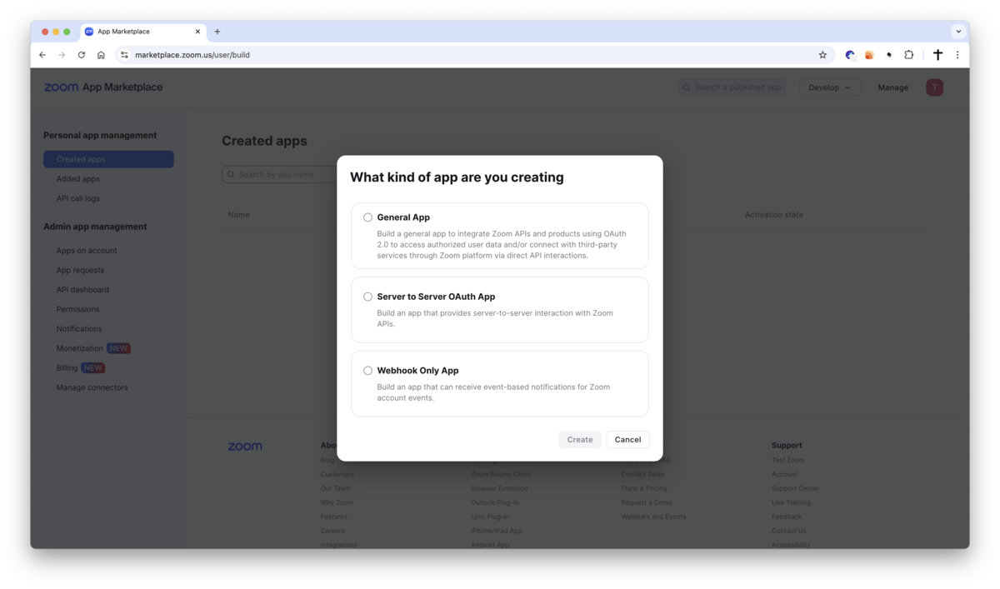
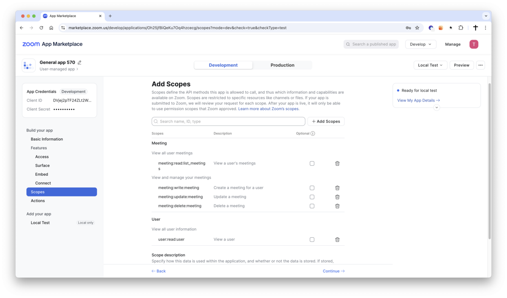
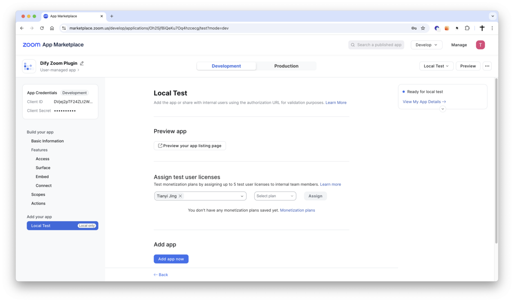
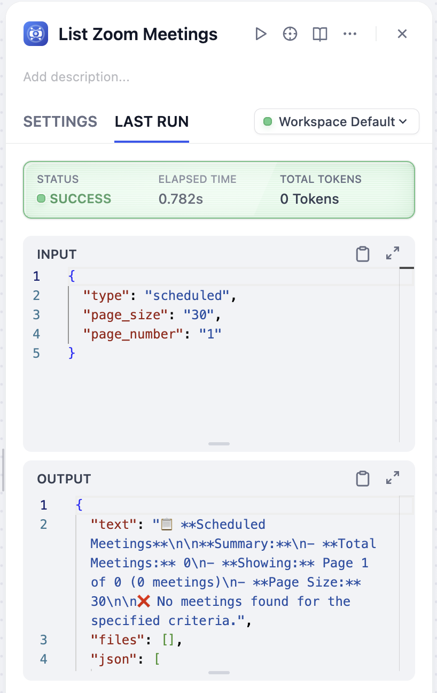

# Dify Zoom Plugin

**Author**: langgenius
**Version**: 0.1.0
**Type**: tool

## Introduction

This plugin integrates with Zoom video conferencing platform, providing comprehensive meeting management capabilities. It enables automated creation, retrieval, updating, and deletion of Zoom meetings through Dify platforms. The plugin supports various meeting types including instant, scheduled, and recurring meetings with advanced configuration options.

## Setup

1. Create your application in the [Zoom App Marketplace](https://marketplace.zoom.us/develop/create).

   

   *Create a new Zoom application*

2. Choose **General App** as the app type.

3. Configure your application as follows:
    - **App name**: Dify Zoom Plugin
    - **Choose your app type**: Server-to-Server OAuth
    - **Would you like to publish this app on Zoom App Marketplace?**: No (for private use)

4. In the **OAuth** section:
    - **OAuth Redirect URL**: Set the appropriate redirect URI:
        - For SaaS (cloud.dify.ai) users: `https://cloud.dify.ai/console/api/oauth/plugin/langgenius/zoom/zoom/tool/callback`
        - For self-hosted users: `http://<YOUR_LOCALHOST_CONSOLE_API_URL>/console/api/oauth/plugin/langgenius/zoom/zoom/tool/callback`
    - **OAuth allow list**: Add your domain if necessary

5. Copy your **Client ID** and **Client Secret** from the App Credentials section.

6. Choose Scopes as follows:

   

   *Configure OAuth permission scopes*

7. Add test user:

   

   *Add test users to your application*

8. Configure the plugin in Dify:
    - Fill in the **Client ID** and **Client Secret** fields with the values from your Zoom app
    - Make sure the redirect URI matches what you configured in the Zoom App Marketplace
    - Click `Save and authorize` to initiate the OAuth flow and grant permissions

9. Complete the OAuth authorization process by logging into your Zoom account and approving the app permissions.

## Usage Demo

*Plugin integration and usage demonstration*

## Tool Descriptions

### zoom_create_meeting
Create a new Zoom meeting with customizable settings and obtain meeting links.

**Parameters:**
- **topic** (string, required): The topic or title of the meeting
- **type** (select, optional): Meeting type - instant (1), scheduled (2), recurring no fixed time (3), or recurring with fixed time (8). Default: scheduled (2)
- **start_time** (string, optional): Meeting start time in ISO 8601 format (e.g., 2024-12-25T10:00:00Z)
- **duration** (number, optional): Meeting duration in minutes (1-1440). Default: 60
- **password** (string, optional): Optional password to secure the meeting
- **waiting_room** (boolean, optional): Enable waiting room for participants. Default: true
- **join_before_host** (boolean, optional): Allow participants to join before the host arrives. Default: false
- **mute_upon_entry** (boolean, optional): Automatically mute participants when they join. Default: true
- **auto_recording** (select, optional): Automatic recording setting - none, local, or cloud. Default: none
- **timezone** (string, optional): Timezone for the meeting. Default: UTC
- **agenda** (string, optional): Meeting agenda or detailed description

**Returns:** Meeting ID, join URL, start URL, password, and meeting details.

### zoom_get_meeting
Retrieve comprehensive information about a Zoom meeting by meeting ID.

**Parameters:**
- **meeting_id** (string, required): The unique identifier of the Zoom meeting
- **occurrence_id** (string, optional): Occurrence ID for recurring meetings
- **show_previous_occurrences** (boolean, optional): Include previous occurrences for recurring meetings. Default: false

**Returns:** Complete meeting information including settings, URLs, host details, and occurrence data for recurring meetings.

### zoom_list_meetings
List all Zoom meetings for the authenticated user with advanced filtering options.

**Parameters:**
- **type** (select, optional): Meeting type filter - scheduled, live, upcoming, upcoming_meetings, or previous_meetings. Default: scheduled
- **page_size** (number, optional): Number of meetings per page (1-300). Default: 30
- **page_number** (number, optional): Page number to retrieve (starts from 1). Default: 1
- **from_date** (string, optional): Start date for filtering meetings (YYYY-MM-DD format)
- **to_date** (string, optional): End date for filtering meetings (YYYY-MM-DD format)

**Returns:** List of meetings with pagination information and applied filters.

### zoom_update_meeting
Update an existing Zoom meeting with new settings and configurations.

**Parameters:**
- **meeting_id** (string, required): The unique identifier of the Zoom meeting to update
- **topic** (string, optional): New meeting topic or title
- **type** (select, optional): New meeting type
- **start_time** (string, optional): New start time in ISO 8601 format
- **duration** (number, optional): New duration in minutes (1-1440)
- **timezone** (string, optional): New timezone identifier
- **password** (string, optional): New meeting password
- **agenda** (string, optional): New meeting agenda or description
- **waiting_room** (boolean, optional): Update waiting room setting
- **join_before_host** (boolean, optional): Update join before host setting
- **mute_upon_entry** (boolean, optional): Update mute upon entry setting
- **auto_recording** (select, optional): New automatic recording setting
- **occurrence_id** (string, optional): Occurrence ID to update a specific occurrence of a recurring meeting

**Returns:** Success status, updated meeting information, and details of changes made.

### zoom_delete_meeting
Delete a Zoom meeting by meeting ID with notification options.

**Parameters:**
- **meeting_id** (string, required): The unique identifier of the Zoom meeting to delete
- **occurrence_id** (string, optional): Occurrence ID to delete a specific occurrence of a recurring meeting
- **schedule_for_reminder** (boolean, optional): Send reminder email to registrants about cancellation. Default: false
- **cancel_meeting_reminder** (boolean, optional): Send cancellation emails to registrants and panelists. Default: false

**Returns:** Success status, deleted meeting information, and deletion type (entire meeting or specific occurrence).

## PRIVACY

Please refer to the [Privacy Policy](PRIVACY.md) for information on how your data is handled when using this plugin.

Last updated: August 2025
